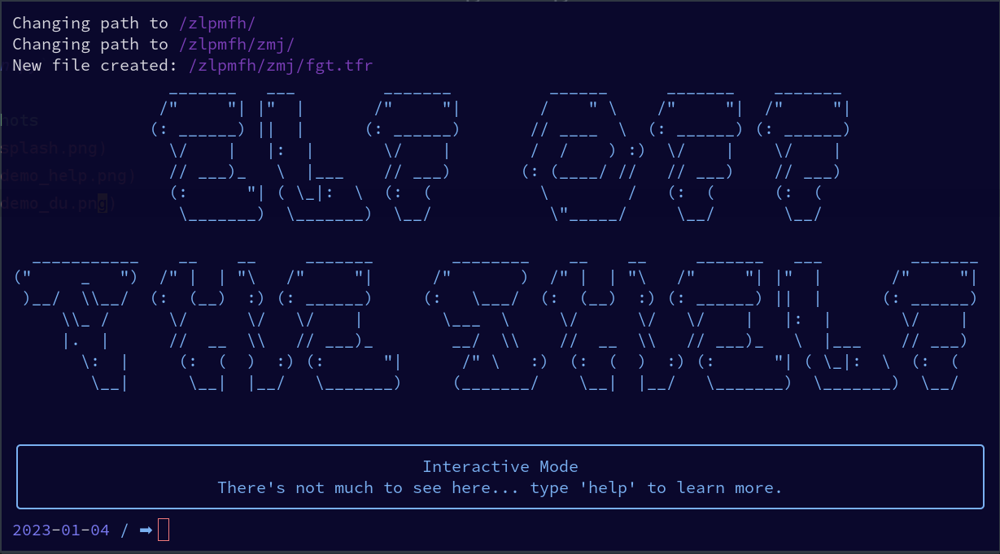
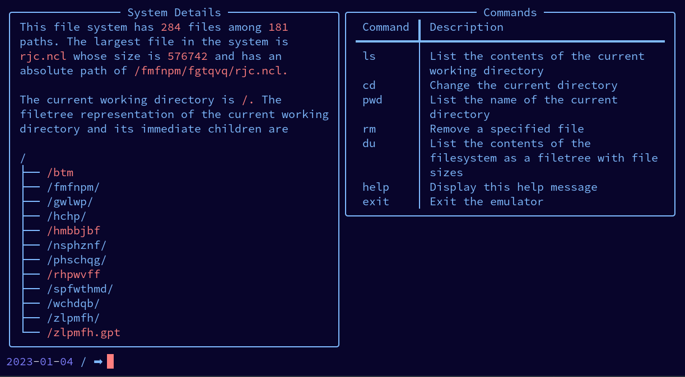

# Elf Off The Shelf
*Elf Off The Shelf* is a completely unnecessarily excessive solution to [day 7 of the 2022 Advent of Code](https://adventofcode.com/2022/day/7) puzzle. To solve the puzzle, the participant is expected to create a set of related data (**paths** and **files**), along with a small range of details, and perform calculations based on the resulting file system. You could do this by emulating a directed graph and utilizing graph traversal algorithms. 

Then, if you were *really* feeling in the spirit of the season, you could write an API for it. 

## Installation
`git clone git@github.com/noprobelm/filesystem-emulator.git && cd filesystem-emulator`

`pip install -r requirements.txt`

## Usage
`python run.py`

## Screenshots
Splash screen

`help` demo

`du` demo

